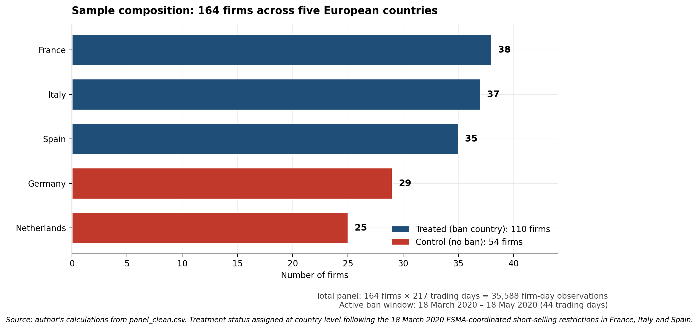
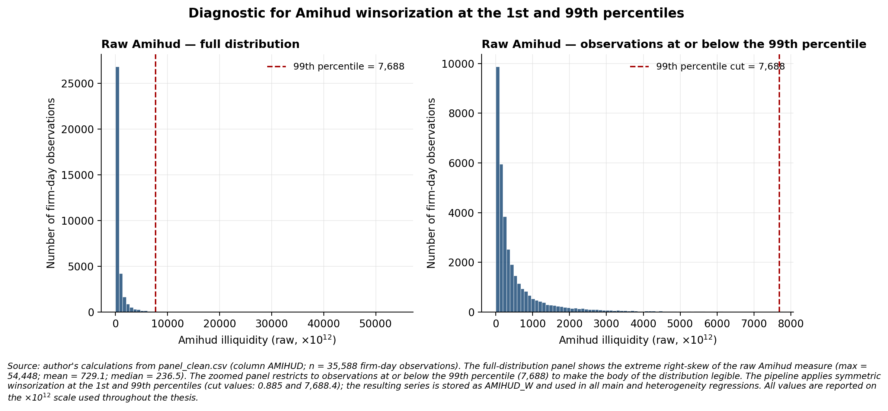
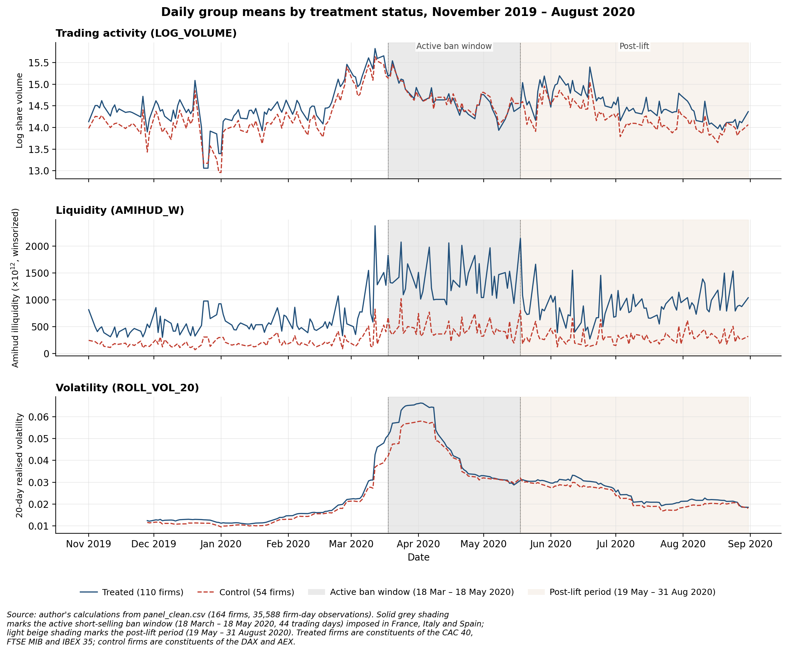
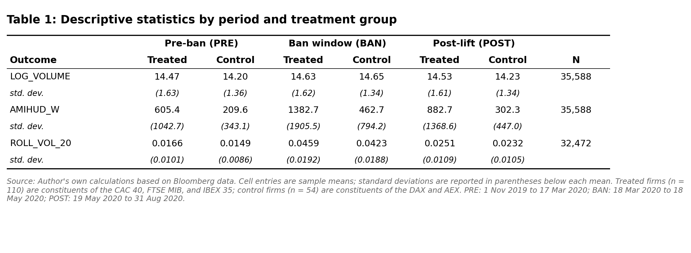
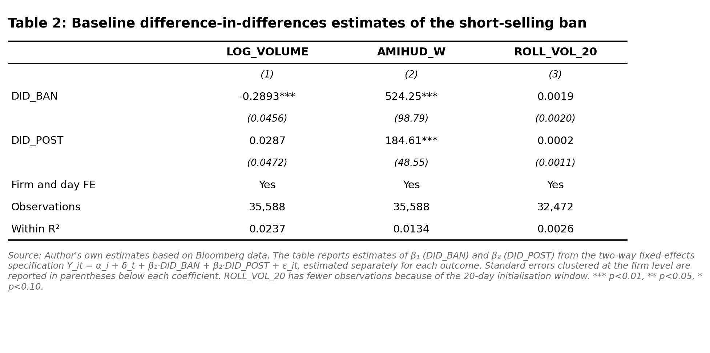
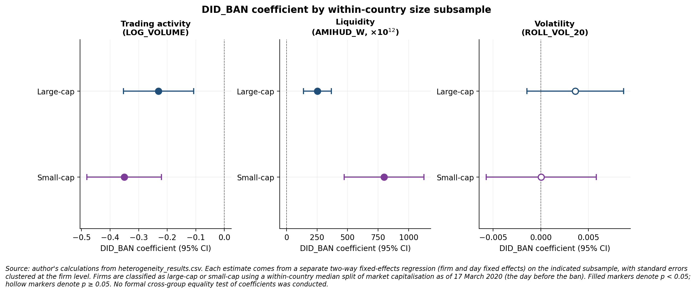
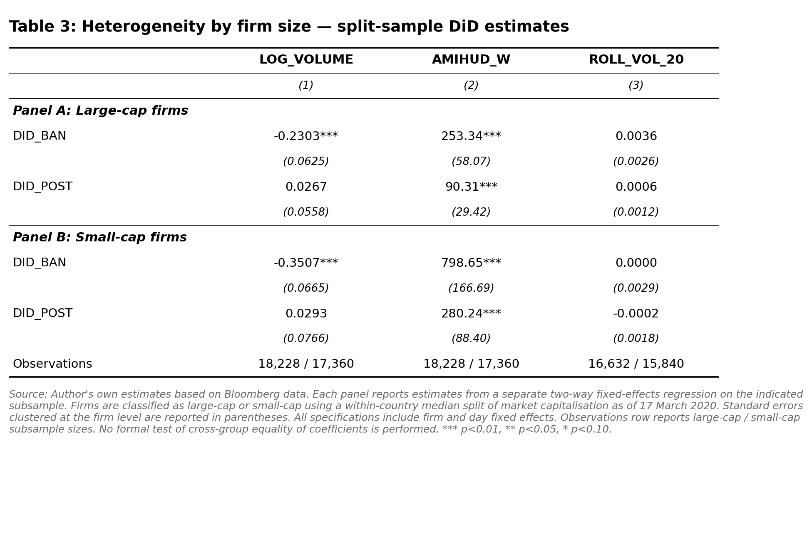
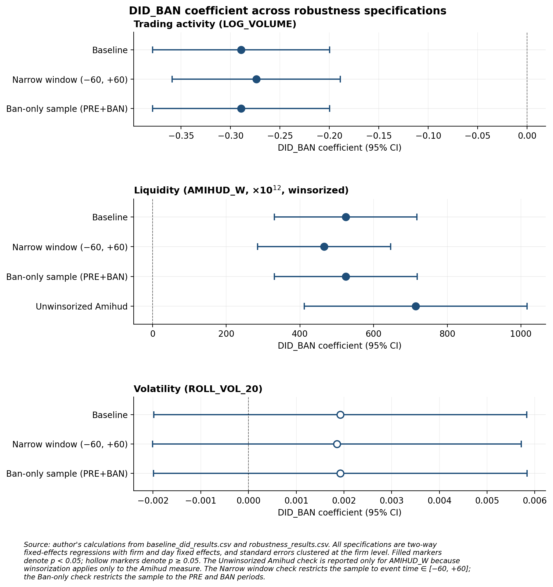
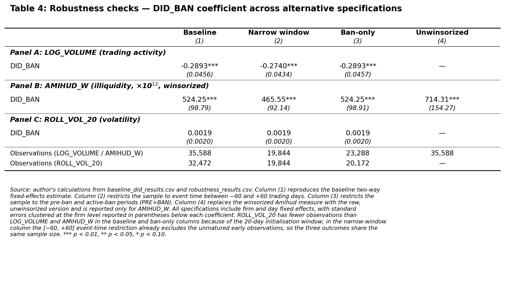
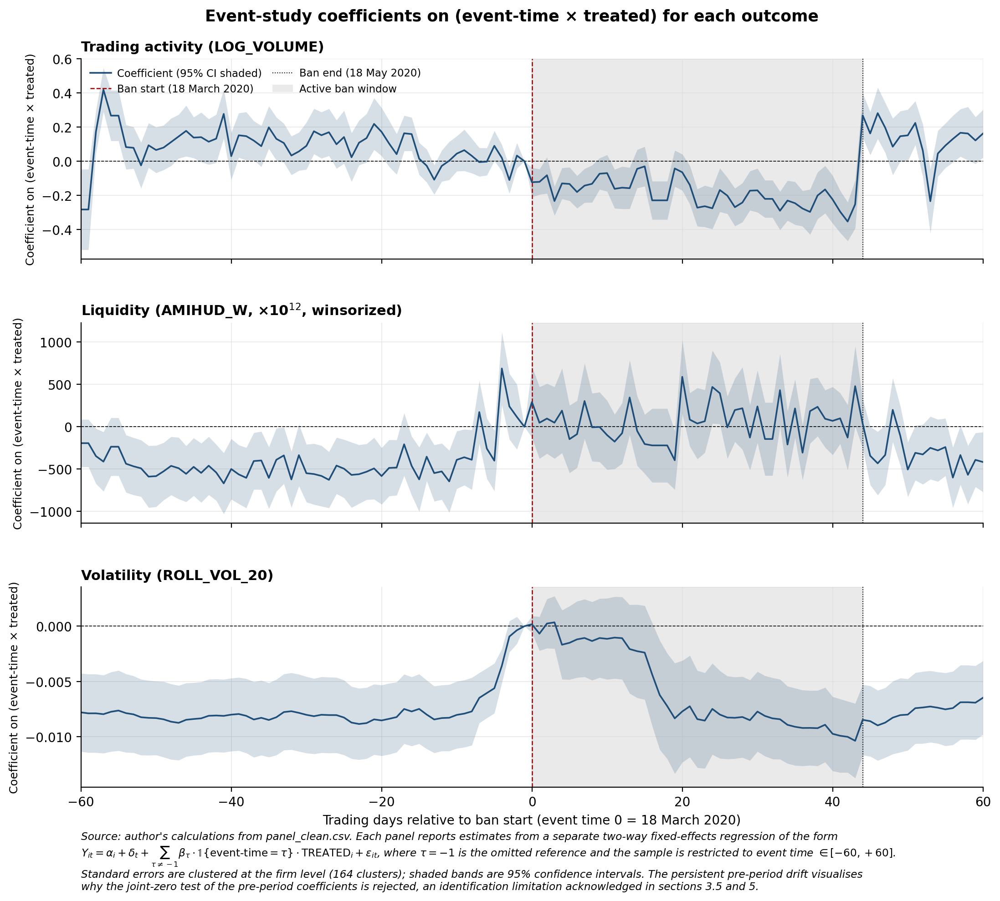

# Short-Selling Bans and Market Quality in European Equity Markets

DiD evidence that the 2020 EU short-selling bans raised trading costs without delivering their stated volatility benefit.

A difference-in-differences study of the March 2020 short-selling bans and their effect on trading activity, illiquidity, and realized volatility across five European equity markets.

Bachelor thesis at ESCP Business School (BSc in Management, Finance Major), supervised by Prof. Dr. Diego Salzman. January to May 2026.

## Research question

In March 2020, France, Italy, and Spain imposed market-wide short-selling bans during the pandemic shock, lifting them on 18 May 2020. Regulators justified the bans as a tool to contain volatility, while prior research links short-selling constraints to lower liquidity and slower incorporation of negative information. This thesis examines what actually happened to trading activity, illiquidity, and return volatility during the active window and after the lift.

## Key findings

Using a two-way fixed-effects difference-in-differences design on a daily panel of 164 benchmark-index constituents (35,588 firm-day observations) across five European markets, the analysis compares banning countries (France, Italy, Spain) against non-banning controls (Germany, Netherlands) around the 2020 short-selling bans.

- **Trading activity fell.** Treated firms showed roughly 25% lower trading activity during the active ban window (DID_BAN = −0.289 on log volume, p < 0.01). The effect faded after the 18 May lift, with the post-lift coefficient statistically indistinguishable from zero.
- **Illiquidity rose and persisted.** Illiquidity increased sharply during the ban (AMIHUD_W DID_BAN = 524.25, p < 0.01) and remained elevated after the lift (184.61, p < 0.01), suggesting liquidity costs did not unwind cleanly when the restriction ended.
- **No volatility effect.** The dimension the bans were meant to address showed no measurable differential response in either window. The stated regulatory benefit is the one margin where treated and control firms moved together.
- **Effects concentrated in smaller firms.** Under a within-country median size split, point estimates for trading activity and illiquidity were larger for small-cap firms.

**Identification note.** Event-study estimates reject parallel pre-trends for all three outcomes (joint Wald test, p < 0.01), and the ban window overlaps the ECB PEPP announcement and country-specific interventions. Results are reported as conditional associations consistent with the bans, not causal effects.

## Data and sample

Daily Bloomberg panel of 164 benchmark-index constituents over 1 November 2019 to 31 August 2020, totalling 35,588 firm-day observations. France, Italy, and Spain are treated; Germany and the Netherlands serve as controls.



*Figure 1: Sample composition by country and treatment status.*

Fields extracted from Bloomberg: PX_LAST, PX_VOLUME, CUR_MKT_CAP, PX_OPEN, PX_HIGH, PX_LOW, and DAY_TO_DAY_TOT_RETURN_GROSS_DVDS.

## Method

A two-way fixed effects difference-in-differences specification with firm and day fixed effects, and standard errors clustered at the firm level. The model includes two treatment indicators: one for treated firms during the active ban window (DID_BAN) and one for treated firms after the bans were lifted (DID_POST). The same specification is estimated separately for each of three outcomes.

Three outcomes:

- `LOG_VOLUME`, the natural log of one plus daily share volume
- `AMIHUD_W`, the winsorized Amihud (2002) illiquidity ratio scaled by 10^12
- `ROLL_VOL_20`, the 20-day rolling standard deviation of daily returns

Heterogeneity by firm size uses the within-country median market capitalization on 17 March 2020 (the day before the ban). Robustness includes a narrow ±60-day event window, a ban-only specification, and an unwinsorized rerun of the Amihud regression.

## Variable construction

The raw Amihud illiquidity ratio exhibits extreme right-skew, with the maximum observation roughly 230 times the median. To prevent these tail values from dominating the regression estimates, the variable is symmetrically winsorized at the 1st and 99th percentiles of the pooled sample. The winsorized version (`AMIHUD_W`) is used in all main and heterogeneity specifications; the unwinsorized version is reported as a robustness check.



*Figure 2: Diagnostic for Amihud winsorization at the 1st and 99th percentiles. Left panel shows the full distribution; right panel zooms into observations at or below the 99th percentile to make the body of the distribution legible.*

## Descriptive evidence

The group-mean trajectories of the three outcomes already show the divergent pattern before any regression is estimated.



*Figure 3: Daily group means by treatment status, November 2019 to August 2020. Treated firms (solid line) versus control firms (dashed line). Grey shading marks the active ban window, beige shading marks the post-lift period.*

Trading activity falls during the ban and rebounds after the lift. Illiquidity rises sharply and remains visibly elevated long after the bans are lifted. The volatility series moves together across treated and control firms during the COVID stress period, with no apparent treated-control gap.

Sample means by period make the same point in numbers. The mean of `AMIHUD_W` in treated firms more than doubles from 605.4 in the pre-ban period to 1,382.7 during the active window, and remains elevated at 882.7 after the lift. Control firms move from 209.6 to 462.7 to 302.3 over the same periods.



*Table 1: Descriptive statistics by period and treatment group.*

## Headline results



*Table 2: Baseline difference-in-differences estimates of the short-selling ban.*

Three findings:

1. Trading activity falls during the ban (-0.289, p < 0.01) and recovers after the lift. The drop corresponds to roughly a 25% reduction in daily share volume on treated firms during the active window. The post-lift coefficient is small and statistically indistinguishable from zero.
2. Illiquidity rises during the ban (524.25, p < 0.01) and remains elevated after (184.61, p < 0.01). The deterioration in price-impact-per-unit-of-trading persists into the post-lift period, contrary to a clean policy reversal.
3. No statistically significant volatility differential is detected during or after the ban, despite the policy being justified on volatility-containment grounds.

## Heterogeneity by firm size

Splitting the sample at the within-country median market capitalization on the day before the ban shows that the two significant findings, on trading activity and illiquidity, are concentrated in small-cap firms. Volatility shows no effect in either subsample.



*Figure 4: DID_BAN coefficient by within-country size subsample. Filled markers denote p < 0.05; hollow markers denote p ≥ 0.05.*

The full coefficient panel confirms the visual story. The small-cap illiquidity coefficient (798.65) is more than three times the large-cap coefficient (253.34), and the post-lift small-cap differential (280.24) is also three times the large-cap value (90.31). Volume reductions follow the same asymmetric pattern.



*Table 3: Heterogeneity by firm size, split-sample DiD estimates.*

This pattern is consistent with the literature: short-selling constraints bite hardest where market-making capital is thinner.

## Robustness

The headline `DID_BAN` coefficients are stable across alternative specifications. The narrow ±60 trading-day event window, the ban-only sample (pre-ban and active-ban periods only), and the unwinsorized Amihud rerun all return DID_BAN estimates of the same sign, similar magnitude, and the same statistical significance as the baseline.



*Figure 5: DID_BAN coefficient across robustness specifications. Filled markers denote p < 0.05; hollow markers denote p ≥ 0.05.*

The unwinsorized Amihud estimate is, if anything, larger than the winsorized baseline (714.31 versus 524.25), confirming that the winsorization choice produces a conservative estimate of the illiquidity effect rather than inflating it.



*Table 4: Robustness checks, DID_BAN coefficient across alternative specifications.*

## Identification caveats

The event-study estimates do not support a clean parallel pre-trends assumption.



*Figure 6: Event-time difference-in-differences estimates for trading activity, illiquidity, and volatility around the short-selling ban. Shaded bands are 95% confidence intervals.*

Pre-period coefficients for illiquidity drift, and a joint-zero test of the pre-period coefficients is rejected. The active ban window also overlaps the ECB Pandemic Emergency Purchase Programme along with country-specific fiscal and prudential interventions. Estimates are therefore reported as conditional associations consistent with the bans rather than causal effects, an identification limitation acknowledged in Sections 3.5 and 5 of the thesis.

## Repository structure

```
.
├── README.md
├── LICENSE
├── requirements.txt
├── thesis_main.ipynb              full analysis notebook (23 steps)
├── figures/
│   ├── fig_sample_composition.png
│   ├── fig_descriptive_timeseries.png
│   ├── fig_event_study.png
│   ├── fig_heterogeneity_coefficients.png
│   ├── fig_robustness_coefficients.png
│   └── fig_prewinsorization_diagnostic.png
├── tables/
│   ├── table1_descriptive_stats.png
│   ├── table2_baseline_did.png
│   ├── table3_heterogeneity.png
│   └── table4_robustness.png
└── outputs/
    ├── baseline_results.csv
    ├── heterogeneity_results.csv
    └── robustness_results.csv
```

## How to reproduce

The raw Bloomberg data files are not included in this repository, as Bloomberg licensing terms prohibit redistribution. A user with Bloomberg Terminal access can rebuild the dataset by exporting the index-constituent fields listed above for the CAC 40, FTSE MIB, IBEX 35, DAX, and AEX over the sample period, saving each as `<INDEX>_Index.xlsx` and `<INDEX>_Metadata.xlsx` in the project root.

With the data in place:

```bash
pip install -r requirements.txt
jupyter notebook thesis_main.ipynb
```

The notebook runs end-to-end in 23 numbered steps, from environment setup through final exports.

## Tech stack

Python 3.12, pandas, numpy, linearmodels (PanelOLS), matplotlib, openpyxl.

## Author

Viktorie Kodickova, ESCP Business School, BSc in Management (Finance Major).
